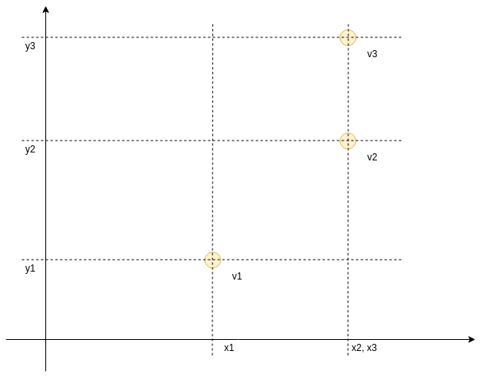
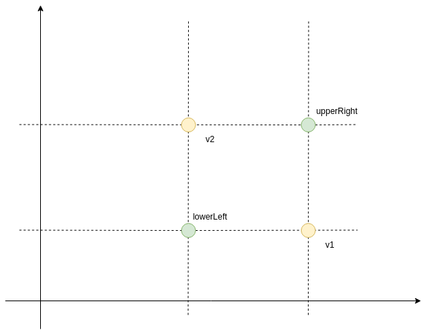

# Laboratorium 2

Celem laboratorium jest zapoznanie się z modelem obiektowym Javy, na przykładzie klasy reprezentującej dwuwymiarowy
wektor. Ponadto studenci zapoznają się z frameworkiem do testowania.

## Przydatne informacje

* Pola w obiekcie deklarowane są w ciele klasy, np. 
```java
class Vector2d {
  public int x;
  public int y;
}
```
* Konstruktor jest specjalną metodą w każdej klasie. Nazywa się tak samo jak klasa i nie zwraca wartości. Konstruktor 
pozwala ustalić początkową wartość pól obiektu, jeśli mają być przekazane przez użytkownika, np.
```java
class Vector2d {
  public Vector2d(int x, int y){
    this.x = x;
    this.y = y;
  }
}
```
* Obiekty klasy tworzy się za pomocą wywołania `new`, np. 
```java
Vector2d position1 = new Vector2d(1,2);
```
* Słowo kluczowe `this` odnosi się do obiektu, na rzecz którego wywołano metodę.
Przykładowo w języku C moglibyśmy zdefiniować metodę `createPoint`:

```C
struct Point {
  int x;
  int y;
}

struct Point * createPoint(int x, int y){
  struct Point * result = malloc(sizeof(struct Point));
  result->x = x;
  result->y = y;
  return result;
}

struct Point * p1 = createPoint(1,2);
```

Ten kod jest analogiczny do konstruktora, z ta różnicą, że w konstruktorze nie tworzymy obiektu *explicite*, tylko mamy do
niego dostęp za pomocą słowa kluczowego `this`.

* Metoda `equals` ma zwykle taki sam schemat:

```java
public boolean equals(Object other){
  if (this == other)
    return true;
  if (!(other instanceof Vector2d))
    return false;
  Vector2d that = (Vector2d) other;
  // tutaj przeprowadzane jest faktyczne porównanie
}
```

Należy również wiedzieć, że zmiana metody `equals` powinna powodować zmianę metody `hashCode`, w przeciwnym razie
umieszczenie obiektów w kolekcji takiej jak `Set` będzie niezgodne z semantyką metody `equals`.


* Definicję typu wyliczeniowego można rozszerzać dodając do niego pola i metody. Wymaga to umieszczenia średnika po ostatniej
  wartości typu, np.:
```java
enum MapDirection {
  NORTH,
  SOUTH,
  EAST,
  WEST;

  public String toString(){
    switch(this) {
      case NORTH: return "Północ";
      case SOUTH: return "Południe";
      //...
    }
  }
}
```

* Metody testujące posiadają adnotację `@Test`.

* W metodach testujących można użyć np. następujących asercji:
  * `assertEquals(a, b)` - weryfikuje czy obiekty `a` i `b` są sobie równe (korzystając z metody `equals`),
  * `assertTrue(a)` - weryfikuje czy wartość logiczna `a` jest prawdą,
  * `assertFalse(a)` - weryfikuje czy wartość logiczna `a` jest fałszem.

## Zadania do wykonania

### Klasa `Vector2d`

1. Pliki projektu należy umieszczać w pakiecie `agh.cs.lab2`.
2. Utwórz klasę `World` z metodą `main`.
3. Utwórz klasę `Vector2d`, która:
   * posiada dwa publiczne pola `x` i `y` typu `int`, które nie mogą być modyfikowane (`final`),
   * posiada konstruktor akceptujący parametry `x` i `y`, która są przypisywane do pól `x` i `y`,
   * posiada metodę `String toString()`, która zamienia pozycję na napis `(x,y)`, np. dla `x = 1` oraz `y = 2`, napis ma postać
     `(1,2)`,
   * posiada metodę `boolean precedes(Vector2d other)`, akceptującą inny obiekt tej klasy i zwracającą wartość `true`, jeśli oba pola mają
     wartość mniejszą bądź równą polom drugiego obiektu,
   * posiada metodę `boolean follows(Vector2d other)`, akceptującą inny obiekt tej klasy i zwracającą wartość `true`, jeśli oba pola mają
     wartość większą bądź równą polom drugiego obiektu,
   * posiada metodę `Vector2d upperRight(Vector2d other)`, która akceptuje inny punkt i zwraca obiekt klasy `Vector2d` posiadający te składowe
     punktów, które mają większe wartości dla odpowiednich osi (innymi słowy jest prawym górnym rogiem prostokąta, który
     opisany jest na obu punktach, którego krawędzie są równoległe do osi X i Y),
   * posiada metodę `Vector2d lowerLeft(Vector2d other)`, która akceptuje inny punkt i zwraca obiekt klasy `Vector2d` posiadający te składowe
     punktów, które mają mniejsze wartości dla odpowiednich osi (tzn. lewy dolny róg prostokąta),
   * posiada metodę `Vector2d add(Vector2d other)`, która zwraca nowy obiekt klasy `Vector2d`, którego składowe są sumą odpowiednich składowych
     dodawanych pozycji,
   * posiada metodę `Vector2d subtract(Vector2d other)`, która zwraca nowy obiekt klasy `Vector2d`, którego składowe są różnicą 
     odpowiednich składowych odejmowanych pozycji, 
   * posiada metodę `boolean equals(Object other)` która zwraca prawdę jeśli obie pozycje są sobie równe (zwróć uwagę na typ parametru),
   * posiada metodę `Vector2d opposite()`, która zwraca nowy obiekt tej klasy, posiadający zmienione znaki obu składowych.
3. Poniższy obrazek ilustruje metody `precedes` i `follows`. `v1` poprzedza (precedes) `v2` oraz `v3`. `v2` poprzedza `v3`.
   Wszystkie wektory poprzedzają również same siebie (relacja ta jest zwrotna). `v3` następuje po (follows) `v2` oraz
   `v1`, `v2` następuje po `v1`. Wszystkie wektory następują również po samych sobie.
   
3. Poniższy obrazek ilustruje metody `lowerLeft` oraz `upperRight`.
   
4. W metodzie `main` wprowadź następujący kod:
```java
Vector2d position1 = new Vector2d(1,2);
System.out.println(position1);
Vector2d position2 = new Vector2d(-2,1);
System.out.println(position2);
System.out.println(position1.add(position2));
```
Sprawdź czy uzyskane wyniki są poprawne.

### Pozostałe klasy

6. Utwórz typ wyliczeniowy `MoveDirection` z czterema kierunkami: `FORWARD, BACKWARD, RIGHT, LEFT`.
7. Utwórz typ wyliczeniowy `MapDirection` z czterema kierunkami: `NORTH, SOUTH, WEST, EAST`, który:
   * posiada metodę `toString`, która dla kierunku `EAST` zwraca łańcuch `Wschód`, dla `WEST` - `Zachód`, itd.
   * posiada metodę `next`, która dla kierunku `EAST` zwraca `SOUTH` (kolejny kierunek zgodnie z ruchem wskazówek
     zegara), itd.
   * posiada metodę `previous`, która dla kierunku `EAST` zwraca `NORTH` (kolejny kierunek zgodnie z ruchem przeciwnym
     do ruchu wskazówek zegara), itd.
   * posiada metodę `toUnitVector`, która zwraca jednostkowy wektor przemieszczenia typu `Vector2d` zgodny z orientacją na mapie,
     tzn. dla `NORTH` wektor ten powinien mieć wartość `(0,1)`, dla `EAST` `(1,0)`, itd.
7. Sprawdź w metodzie `main` czy metody te działają zgodnie z opisem.


### Testy

1. Przenieś kod źródłowy do katalogu `src/main`.
2. Utwórz katalog `src/test`.
2. Dodaj bibliotekę JUnit 4 lub 5:
   * File -> Project structure -> Modules -> Dependencies -> (kliknij + po prawej stronie) -> library -> From maven
   * w okienko wpisujemy junit:junit -> search
   * wybieramy dostępną wersję JUnit (najnowszą ale bez SNAPSHOT)
   * zmieniamy Scope na test (w okienku Dependencies)
3. Utwórz klasę `MapDirectionTest`.
4. Zaimplementuj test weryfikujący poprawność działania metody `next()`, dla wszystkich przypadków (dodaj anotację
   `@Test` przed deklaracją metody).
4. Uruchom test korzystając z menu `Run all tests`.
5. Zaimplementuj test weryfikujący poprawność działania metody `previous()`, dla wszystkich przypadków.
6. Utwórz klasę `Vector2dTest`.
7. Dodaj testy weryfikujące poprawność metod: `equals(Object other)`, `toString()`, `precedes(Vector2d other)`, `follows(Vector2d other)`,
   `upperRight(Vector2d other)`, `lowerLeft(Vector2d other)`, `add(Vector2d other)`, `subtract(Vector2d other)`,
   `opposite()`.


